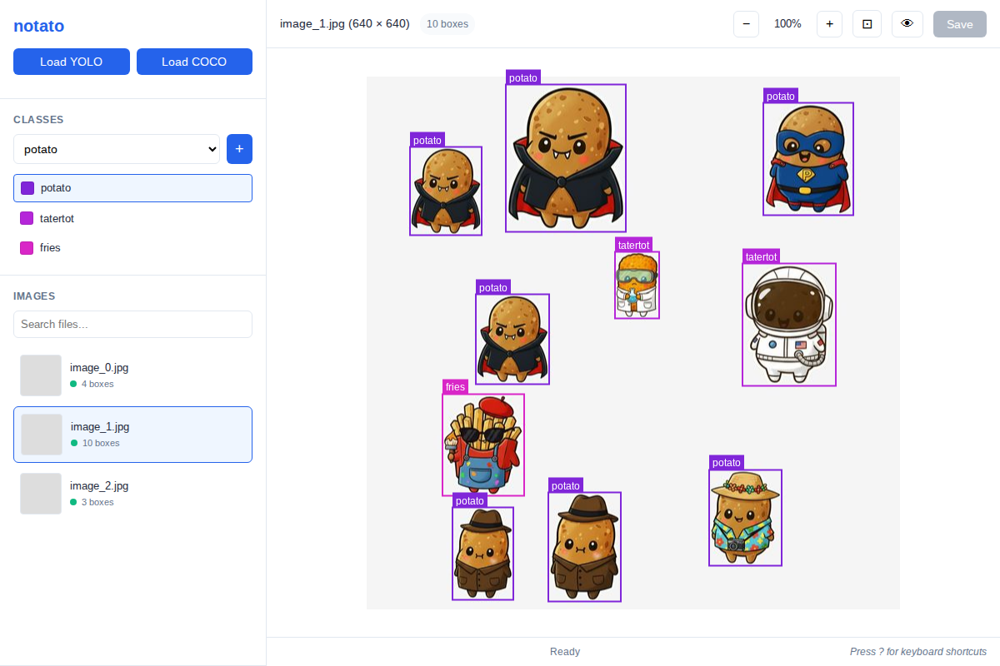

# notato - Image Annotation Tool

A lightweight, browser-based image annotation tool for creating bounding box annotations in YOLO and COCO formats.



## Features

- 🎯 **Zero Installation**: Single HTML file - download and open in your browser
- 📦 **Multiple Formats**: Native support for YOLO, COCO, and Ultralytics NDJSON annotation formats
- 🖼️ **Intuitive UI**: Simple two-column layout with thumbnail preview
- ⚡ **Works Offline**: No internet connection required
- 🎨 **Visual Editing**: Draw, resize, and move bounding boxes with ease
- ⌨️ **Keyboard Shortcuts**: Speed up your workflow with shortcuts

## Quick Start

1. **Visit** [https://brianlow.github.io/notato/](https://brianlow.github.io/notato/)
2. **Select format** (YOLO, COCO, or NDJSON)
3. **Open folder** with your images
4. **Start annotating!**

## Running Locally

If you prefer to run notato locally:

1. **Download** the `notato.html` file from the `dist/` folder
2. **Start a local server** (required for file access):
   ```bash
   python3 -m http.server 8000
   ```
3. **Open** `http://localhost:8000/notato.html` in your browser

## Development

### Setup

```sh
npm install     # one time setup
npm run dev     # open http://localhost:8080
npm run build   # test the build
```

### Testing

Unit tests:
```sh
npm test                 # Run all unit tests once
npm run test:watch       # Run tests in watch mode (re-runs on changes)
npm run test:ui          # Open Vitest UI in browser
```

Playwright E2E tests:
```sh
npm run test:e2e:install  # Install Chromium browser (one-time setup)
npm run test:e2e         # Run E2E tests (headless)
npm run test:e2e:headed  # Run E2E tests with visible browser
npm run test:e2e:ui      # Open Playwright UI for debugging tests
```

## Supported Formats

### YOLO Format

One `.txt` file per image with normalized coordinates:

```
<class_id> <center_x> <center_y> <width> <height>
```

Example folder structure:
```
image1.jpg
image1.txt
image2.jpg
image2.txt
```

### COCO Format

Single `annotations.json` file for the entire dataset:

```json
{
  "images": [...],
  "annotations": [...],
  "categories": [...]
}
```

### Ultralytics NDJSON Format

Newline-delimited JSON format with one record per line. The first line contains dataset metadata, and subsequent lines contain image records with annotations.

Format: `dataset.ndjson` or any `.ndjson`/`.json` file

```json
{"type":"dataset","task":"detect","class_names":{"0":"person","1":"car","2":"dog"}}
{"type":"image","file":"image1.jpg","width":640,"height":480,"annotations":{"boxes":[[0,0.5,0.5,0.3,0.4]]}}
{"type":"image","file":"image2.jpg","width":640,"height":480,"annotations":{"boxes":[[1,0.25,0.75,0.2,0.3]]}}
```

Box format: `[class_id, center_x, center_y, width, height]` (normalized 0-1)

## Keyboard Shortcuts

- `Delete` - Delete selected box
- `Escape` - Deselect box / cancel drawing
- `Arrow keys` - Navigate between images
- `+/-` - Zoom in/out
- `0` - Fit to screen
- `H` - Toggle hide/show all boxes
- `Ctrl+S` / `Cmd+S` - Save

## Browser Compatibility

- **Chrome/Edge 86+**: Full support with File System Access API
- **Firefox**: Not supported
- **Safari**: Not supported

## Troubleshooting

### File access not working?

Make sure you're running the app from a local server (not opening the file directly). The File System Access API requires a server context.

### Can't see my annotations?

- For YOLO: Check that `.txt` files have the same name as images
- For COCO: Look for `annotations.json` or `instances_default.json`
- For NDJSON: Look for `dataset.ndjson` or any `.ndjson`/`.json` file
- Verify the format matches the selected mode

### Images not loading?

Supported formats: `.jpg`, `.jpeg`, `.png`, `.gif`, `.webp`, `.bmp`
